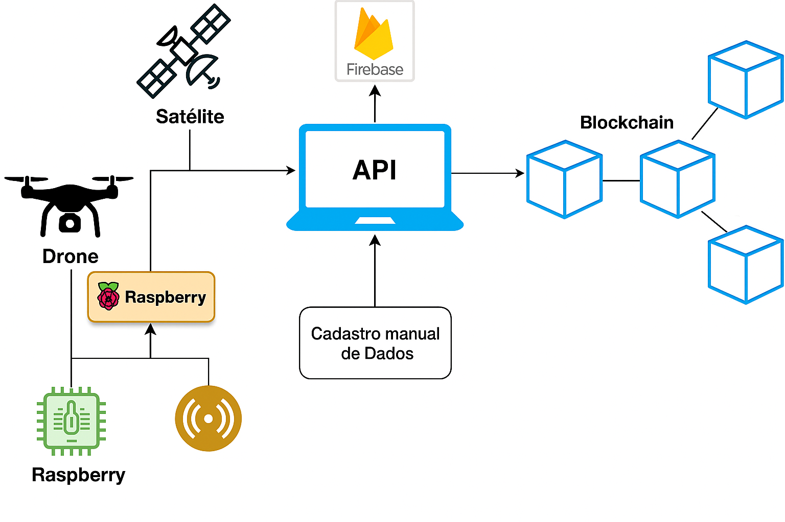

# 🌱 RASTREIA.ORG – API

API RESTful para rastrear dados agrícolas de sensores, drone e satélite, com armazenamento em Firebase e registro em Blockchain.

## 🚀 Como rodar
```bash
npm install
cp .env.example .env
npm start
```

## 📡 Rotas principais
- `GET /sensor/solo` → Dados simulados do solo
- `POST /sensor/manual` → Cadastro manual
- `POST /sensor/raspberry` → Dados do Raspberry Pi
- `POST /imagens/drone` → Registrar imagem do drone
- `POST /imagens/satelite` → Registrar imagem do satélite
- `GET /imagens/relatorio` → Relatório de imagens

## 📊 Fluxograma atualizado com Drone e Satélite
